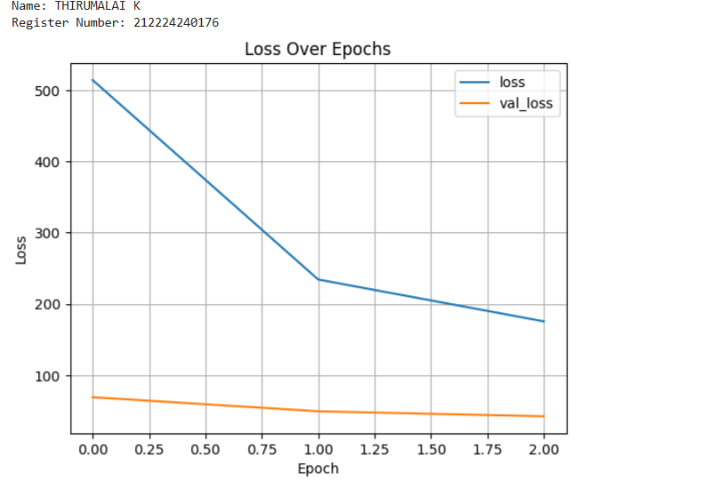
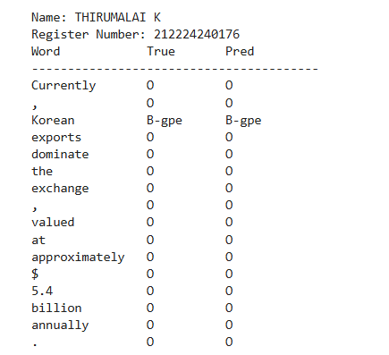

# DL- Developing a Deep Learning Model for NER using LSTM

## AIM
To develop an LSTM-based model for recognizing the named entities in the text.


## Neural Network Model
Include the neural network model diagram.

## DESIGN STEPS
### STEP 1: 

Load data, create word/tag mappings, and group sentences.

### STEP 2: 

Convert sentences to index sequences, pad to fixed length, and split into training/testing sets.

### STEP 3: 

Define dataset and DataLoader for batching.

### STEP 4: 

Build a bidirectional LSTM model for sequence tagging.

### STEP 5: 

Train the model over multiple epochs, tracking loss.

### STEP 6: 


Evaluate model accuracy, plot loss curves, and visualize predictions on a sample.


## PROGRAM

### Name: THIRUMALAI K

### Register Number: 212224240176

```python

import pandas as pd
import torch
import torch.nn as nn
import numpy as np
import matplotlib.pyplot as plt
from torch.utils.data import Dataset, DataLoader
from torch.nn.utils.rnn import pad_sequence
import warnings
warnings.filterwarnings("ignore", category=DeprecationWarning)

device = torch.device('cuda' if torch.cuda.is_available() else 'cpu')
print(f"Using device: {device}")

data = pd.read_csv("ner_dataset.csv", encoding="latin1").ffill()

words = list(data["Word"].unique())
tags = list(data["Tag"].unique())

if "ENDPAD" not in words:
    words.append("ENDPAD")

if "PAD" not in tags:
    tags.append("PAD")

if "O" not in tags:
    print("Warning: 'O' tag not present in dataset. Continuing without it.")


word2idx = {w: i + 1 for i, w in enumerate(words)}  
tag2idx = {t: i for i, t in enumerate(tags)}       
idx2tag = {i: t for t, i in tag2idx.items()}

print("Unique words in corpus:", data['Word'].nunique())
print("Unique tags in corpus:", data['Tag'].nunique())
print("All tags (including PAD):", tags)

class SentenceGetter:
    def __init__(self, data):
       
        grouped = data.groupby("Sentence #", group_keys=False).apply(
            lambda s: [(w, t) for w, t in zip(s["Word"], s["Tag"])]
        )
        self.sentences = list(grouped)

getter = SentenceGetter(data)
sentences = getter.sentences
print("Example sentence (index 0):", sentences[0])

X = [[word2idx[w] for w, t in s] for s in sentences]
y = [[tag2idx[t] for w, t in s] for s in sentences]

plt.hist([len(s) for s in sentences], bins=50)
plt.title("Sentence length distribution")
plt.xlabel("Length")
plt.ylabel("Count")
plt.show()

max_len = 50

X_tensors = [torch.tensor(seq, dtype=torch.long) for seq in X]
y_tensors = [torch.tensor(seq, dtype=torch.long) for seq in y]

pad_input_value = word2idx["ENDPAD"]                   
pad_label_value = tag2idx["PAD"]                       

X_pad = pad_sequence(X_tensors, batch_first=True, padding_value=pad_input_value)
y_pad = pad_sequence(y_tensors, batch_first=True, padding_value=pad_label_value)

if X_pad.size(1) < max_len:

    pad_amt = max_len - X_pad.size(1)
    X_pad = torch.cat([X_pad, torch.full((X_pad.size(0), pad_amt), pad_input_value, dtype=torch.long)], dim=1)
    y_pad = torch.cat([y_pad, torch.full((y_pad.size(0), pad_amt), pad_label_value, dtype=torch.long)], dim=1)
else:
    X_pad = X_pad[:, :max_len]
    y_pad = y_pad[:, :max_len]

print("X_pad shape:", X_pad.shape)
print("y_pad shape:", y_pad.shape)

dataset_size = X_pad.size(0)
perm = torch.randperm(dataset_size)
train_size = int(0.8 * dataset_size)
train_idx = perm[:train_size]
test_idx = perm[train_size:]

X_train = X_pad[train_idx]
y_train = y_pad[train_idx]
X_test = X_pad[test_idx]
y_test = y_pad[test_idx]

class NERDataset(Dataset):
    def __init__(self, X, y):
        self.X = X
        self.y = y
    def __len__(self):
        return len(self.X)
    def __getitem__(self, idx):
        return {
            "input_ids": self.X[idx],
            "labels": self.y[idx]
        }

train_loader = DataLoader(NERDataset(X_train, y_train), batch_size=32, shuffle=True)
test_loader = DataLoader(NERDataset(X_test, y_test), batch_size=32, shuffle=False)

class BiLSTMTagger(nn.Module):
    def __init__(self, vocab_size, tagset_size, embedding_dim=50, hidden_dim=100, dropout=0.1):
        super(BiLSTMTagger, self).__init__()
        self.embedding = nn.Embedding(vocab_size, embedding_dim, padding_idx=0)
        self.dropout = nn.Dropout(dropout)
        self.lstm = nn.LSTM(embedding_dim, hidden_dim, batch_first=True, bidirectional=True)
        self.fc = nn.Linear(hidden_dim * 2, tagset_size)

    def forward(self, x):
        x = self.embedding(x)           
        x = self.dropout(x)
        x, _ = self.lstm(x)         
        out = self.fc(x)     
        return out

vocab_size = len(word2idx) + 1   
tagset_size = len(tag2idx)

model = BiLSTMTagger(vocab_size=vocab_size, tagset_size=tagset_size).to(device)

loss_fn = nn.CrossEntropyLoss(ignore_index=pad_label_value)
optimizer = torch.optim.Adam(model.parameters(), lr=0.001)

def train_model(model, train_loader, val_loader, loss_fn, optimizer, epochs=3):
    train_losses, val_losses = [], []
    for epoch in range(epochs):
        model.train()
        total_loss = 0.0
        for batch in train_loader:
            input_ids = batch["input_ids"].to(device)
            labels = batch["labels"].to(device)  # shape (batch, seq_len)
            optimizer.zero_grad()
            outputs = model(input_ids)          
            loss = loss_fn(outputs.view(-1, tagset_size), labels.view(-1))
            loss.backward()
            optimizer.step()
            total_loss += loss.item()

        # validation
        model.eval()
        val_loss = 0.0
        with torch.no_grad():
            for batch in val_loader:
                input_ids = batch["input_ids"].to(device)
                labels = batch["labels"].to(device)
                outputs = model(input_ids)
                loss = loss_fn(outputs.view(-1, tagset_size), labels.view(-1))
                val_loss += loss.item()

        train_losses.append(total_loss)
        val_losses.append(val_loss)
        print(f"Epoch {epoch+1}/{epochs} — Train Loss: {total_loss:.4f} — Val Loss: {val_loss:.4f}")

    return train_losses, val_losses

def evaluate_model(model, test_loader):
    model.eval()
    true_tags, pred_tags = [], []
    with torch.no_grad():
        for batch in test_loader:
            input_ids = batch["input_ids"].to(device)
            labels = batch["labels"].to(device)
            outputs = model(input_ids)
            preds = torch.argmax(outputs, dim=-1)
            for i in range(labels.size(0)):
                for j in range(labels.size(1)):
                    lab = labels[i, j].item()
                    if lab != pad_label_value: 
                        true_tags.append(idx2tag[lab])
                        pred_tags.append(idx2tag[preds[i, j].item()])
    return true_tags, pred_tags

train_losses, val_losses = train_model(model, train_loader, test_loader, loss_fn, optimizer, epochs=3)
true_tags, pred_tags = evaluate_model(model, test_loader)

print('Name: THIRUMALAI K')
print('Register Number: 212224240176')
history_df = pd.DataFrame({"loss": train_losses, "val_loss": val_losses})
history_df.plot(title="Loss Over Epochs")
plt.xlabel("Epoch")
plt.ylabel("Loss")
plt.grid(True)
plt.show()

i = 125
model.eval()
sample = X_test[i].unsqueeze(0).to(device)
output = model(sample)
preds = torch.argmax(output, dim=-1).squeeze().cpu().numpy()
true = y_test[i].numpy()

print('Name: THIRUMALAI K')
print('Register Number: 212224240176')
print("{:<15} {:<10} {}\n{}".format("Word", "True", "Pred", "-" * 40))
for w_id, true_tag, pred_tag in zip(X_test[i], y_test[i], preds):
    if w_id.item() != word2idx["ENDPAD"]:
        word = words[w_id.item() - 1]
        true_label = tags[true_tag.item()]
        pred_label = tags[pred_tag]
        print(f"{word:<15} {true_label:<10} {pred_label}")


```

### OUTPUT

## Loss Vs Epoch Plot



### Sample Text Prediction

## RESULT

Thus, an LSTM-based model for recognizing the named entities in the text has been developed successfully.